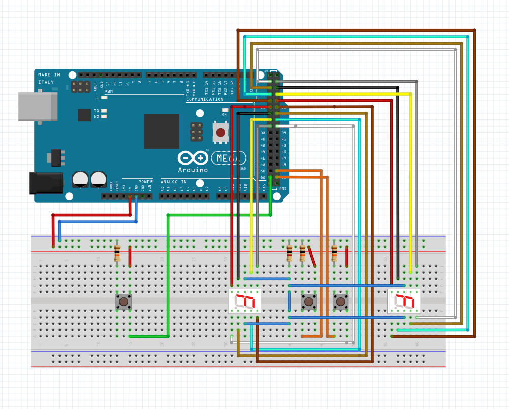
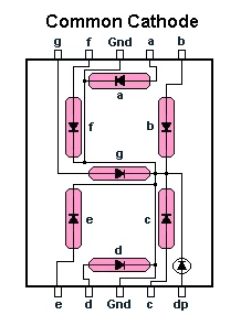
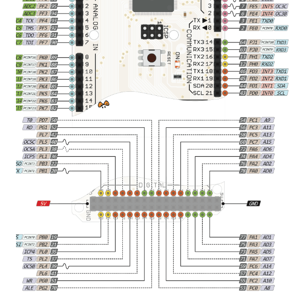

# CAO Project Report
**AVR Project Written in Assembly**
  
**Written By:**  
Christian Schou Sørensen  
Flemming Vindelev  
Ionel-Cristinel Putinica  
Mihail Rumenov Kanchev   

# Purpose
>*“The purpose of this assignment is to write a small software project in assembler code. The MCU to be used is the AVR ATmega2560, and the project should include some form of interaction with sensors and actuators.”*   

# Brainstorming
Firstly, the teacher gave a quick presentation on the different input and output units available in this project. Thereafter, the group started doing some brainstorming on what type of system could be made. The following ideas are what the group came up with, before making the final decision of what to make.  

**Idea 1:**   
The first idea involved using the ultrasonic sensor as input and the LED bar graph as output. This system would measure distance, and the closer it got to something the more bars would light up.  

**Idea 2:**   
The second idea would use the Temperature and humidity sensor together with the 7-segment display. The idea of this system is to measure the temperature and display it on the display.  

**Idea 3:**  
The third idea would utilize the PS2 joystick module and the dot matrix display. This system would light up a dot on the display, this dot would then be "movable" by using the joystick.  

**Idea 4:**  
This idea took a more simple approach where the input would be a button, which would activate the active/passive buzzer.  

**Idea 5:**  
The last idea uses three buttons where two of which, would increment a counter on their own single digit 7-segment display. While the third button would act as a reset for the displays.  

**Conclusion**  
The group ended up implementing the last idea (Idea 5), after researching how to use some of the different components.   

# Problem Statement  
Creators of foosball tables need an easy and reliable way to track the scores of the games, since the physical and primitive system included into their tables are not always reliable, they tend to break or to get worn out.   

# Analysis

## Activity Diagram

 

## State-Machine Diagram
  

# Design

## Breadboard Schematic
 
 

## Connecting the Wires
Boardpins | Displaypins
----------|------------
**FIRST PLAYER**
PA0 | g
PA2 | f 
PA4 | a
PA6 | b
PA1 | e
PA3 | c
PA5 | d
PA7 | dp
PB0 | Input for the button
**SECOND PLAYER**
PC0 | g
PC2 | f
PC4 | a
PC6 | b
PC1 | e
PC3 | c
PC5 | d
PC7 | dp
PB2 | Input for button
 

 

 
 

# Implementation
## Startup
When the system executes it begins from the method start. The start method sets port B as an input. This is done by loading the hex 0x00 value into DDRC register. The PORTC value is also set to 0x00 so each of the bits are fixed and known from the beginning.   
The method start also sets two general purpose registers to 0x00. These registers will be used as counters later in the program to keep track of the amount of button presses.   
The last instruction in the method jumps to the method “picks_a_number_a_out”. This is done to set both displays to 0 from the beginning.  

## Methods for Input
The method “read_button” looks for a button press. This is done by setting the a general purpose registers to be the value of the input. The method will loop until a button with the input to PORTB will be activated. Then the input will be one and branch the BREQ statement and make it able to proceed to the next method.   
The next method “debounce_read” has the functionality of making sure that the button is only pressed once. This is done by creating a delay and then check if the value of the button press is still active, othervise it will loop back to the read “read_button” method. The delay is created with at method that executes a lot of cycles. The delay is calculated to take abound 20ms to execute. If both of the methods above are branched it will take the program to the next method.   
the next method is called “incrementer” the purpose of the method is to detect which button has been pressed and increment the counter. This is performed by the method SBRC – Skip if Bit in Register is Cleared. This make the system ignore the next instruction if the bit is cleared. When the button is pressed the bit for the specific port will be set from 0 to one.  This skips the counter from increasing for the buttons that have not been pressed, this is because the bits are set to clear as default.   
The same happens when the reset button is pressed. If the bit is set it will execute the reset method. the reset method sets both counters to 0x00 and executes from the “picks_a_number_a_out” method. which will set both displays to 0.  

## Methods for Output
The “picks_a_number_a_out” set the value of a new address in the general purpose registers to 0x00 and afterwards add the value of the first counter to the register. This is done the create a copy of the number of increments to prevent it from being decremented.
The next part of the method will count the amount of button presses to match it with the method that will show the number. This is done by using the method BREQ instruction. It will branch if the value of the zero flag is the value of the register is one or more.
The method counts the amount of button press by decrementing the register. The register will branch every time the counter is not zero. When the counter reach zero it will jump to one of the number_a methods. If the counter decreases more than 8 times it will automatically jump to the “number9_a” method. This is done to prevent it from going out of bounce.   
The number_a methods are used to show the number on the display. This is done by setting the DDRA to 1 and the PORTA is set with individual bits for each of the 8 ports. They are set with a binary number because it is easier to make changes. When a bit is 1 it will light up. If a bit is 0 it will be off. Each method is fixed for each number.  The last part of each method jumps “picks_a_number_c_out”.   
“picks_a_number_c_out” and the number_c methods has the same logic as the number_a equivalent. The only difference is that they are changing display 2 at the c ports. An other difference is that each of the number methods takes you to a END method instead. The END method takes you back to the button pressor method.  
Both of the displays will update every time a change has been made to one of the counters.  

## Delay
The delay method creates a delay of 100ms. The delay is created by wasting machine cycles. Each instruction takes a specific amount of machine cycles to execute. All the instructions in our loop takes up 1 cycle except BREN which tacks up 2.
The speed of how fast a machine cycle is executed depends on the frequency of the processor. A 1Mhz processor takes 1μs to execute one machine cycle. That means the mega 2560 processor which is running at 16Mhz is 16 times faster, which is equivalent to 1/16Mhz which is 62.5ns.   
The delay is 100ms which is equal to 100,000,000ns. That means that 100,000,000/62.5ns machine cycles which is calculated 1,600,000. 
The highest number that can be stored in an 8bit register is 255 so it is necessary to use an equation for doing the amount of cycles.
The method to achieve these cycles is none by this equation 
Delay = 250*200*4*8 = 1,600,000*62.5ns = 100,000,000ns = 100ms  
 

# Testing
Test cases have been created for the project, with the purpose of checking if the features and the different components work properly. The only type of testing included is going to be performed on the actual model of the project, since a digital model that allows for testing has not been created.  

## Test Case 1
Test case where both displays start with the value of “0”. The red button, which controls the first display is pressed three times, and after that, the blue button, which controls the second display is pressed five times.   
**Expected result:**  
&nbsp;&nbsp;&nbsp;&nbsp;&nbsp;&nbsp;The 1st display shows the value of “3”  
&nbsp;&nbsp;&nbsp;&nbsp;&nbsp;&nbsp;The 2nd display shows the value of “5”  
**Model result:**  
&nbsp;&nbsp;&nbsp;&nbsp;&nbsp;&nbsp;The 1st display shows the value of “3”  
&nbsp;&nbsp;&nbsp;&nbsp;&nbsp;&nbsp;The 2nd display shows the value of “5”  

## Test Case 2
Test case where the first display starts with the value of “4”, and the second display starts with the value of “7”. The red button, which controls the first display is pressed once, and after that, the blue button, which controls the second display is pressed twice.   
**Expected result:**  
&nbsp;&nbsp;&nbsp;&nbsp;&nbsp;&nbsp;The 1st display shows the value of “5”  
&nbsp;&nbsp;&nbsp;&nbsp;&nbsp;&nbsp;The 2nd display shows the value of “9”  
**Model result:**  
&nbsp;&nbsp;&nbsp;&nbsp;&nbsp;&nbsp;The 1st display shows the value of “5”  
&nbsp;&nbsp;&nbsp;&nbsp;&nbsp;&nbsp;The 2nd display shows the value of “9”  

## Test Case 3
Test case where the first display starts with the value of “4”, and the second display starts with the value of “7”. The red button, which controls the first display is pressed 5 times, and after that, the blue button, which controls the second display is pressed four times. At the end, the white button, which has the purpose of resetting both displays is pressed.   
**Expected result:**  
&nbsp;&nbsp;&nbsp;&nbsp;&nbsp;&nbsp;The 1st display shows the value of “0”  
&nbsp;&nbsp;&nbsp;&nbsp;&nbsp;&nbsp;The 2nd display shows the value of “0”  
**Model result:**  
&nbsp;&nbsp;&nbsp;&nbsp;&nbsp;&nbsp;The 1st display shows the value of “0”  

## Test Case 4
Test case where the first display starts with the value of “4”, and the second display starts with the value of “7”. The red button, which controls the first display is pressed 5 times, and after that, the blue button, which controls the second display is pressed twice times. After that, the white button, which has the purpose of resetting both displays is pressed. The test case is finished by pressing the red button twice, and the blue button seven times.   
**Expected result:**  
&nbsp;&nbsp;&nbsp;&nbsp;&nbsp;&nbsp;The 1st display shows the value of “2”  
&nbsp;&nbsp;&nbsp;&nbsp;&nbsp;&nbsp;The 2nd display shows the value of “7”  
**Model result:**  
&nbsp;&nbsp;&nbsp;&nbsp;&nbsp;&nbsp;The 1st display shows the value of “2”  
&nbsp;&nbsp;&nbsp;&nbsp;&nbsp;&nbsp;The 2nd display shows the value of “7”  

## Test Case 5
Test case where both displays start with the value of “0”. The red button, which controls the first display is pressed four times, and after that, the blue button, which controls the second display is pressed five times. At the end, both the red and the blue button are pressed twice, both at the same time.   
**Expected result:**  
&nbsp;&nbsp;&nbsp;&nbsp;&nbsp;&nbsp;The 1st display shows the value of “6”  
&nbsp;&nbsp;&nbsp;&nbsp;&nbsp;&nbsp;The 2nd display shows the value of “7”  
**Model result:**  
&nbsp;&nbsp;&nbsp;&nbsp;&nbsp;&nbsp;The 1st display shows the value of “6”  
&nbsp;&nbsp;&nbsp;&nbsp;&nbsp;&nbsp;The 2nd display shows the value of “7”  

## Test Case 6
Test case where the first display starts with the value of “2”, and the second display starts with the value of “6”. The red button, which controls the first display is pressed once, and after that, the blue button, which controls the second display is pressed three times. At the end, the red button and the white button are pressed at the same time.   
**Expected result:**  
&nbsp;&nbsp;&nbsp;&nbsp;&nbsp;&nbsp;The 1st display shows the value of “0”  
&nbsp;&nbsp;&nbsp;&nbsp;&nbsp;&nbsp;The 2nd display shows the value of “0”  
**Model result:**  
&nbsp;&nbsp;&nbsp;&nbsp;&nbsp;&nbsp;The 1st display shows the value of “0”  
&nbsp;&nbsp;&nbsp;&nbsp;&nbsp;&nbsp;The 2nd display shows the value of “0”  

## Test Case 7
Test case where the first display starts with the value of “0”, and the second display starts with the value of “2”. The red button, which controls the first display is pressed ten times, and after that, the blue button, which controls the second display is pressed twelve times.   
**Expected result:**  
The 1st display shows the value of “9”  
The 2nd display shows the value of “9”  
**Model result:**  
The 1st display shows the value of “9”  
The 2nd display shows the value of “9”   
