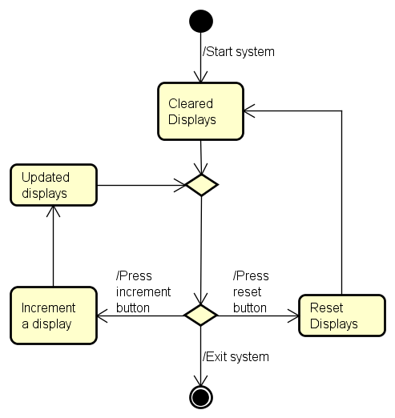
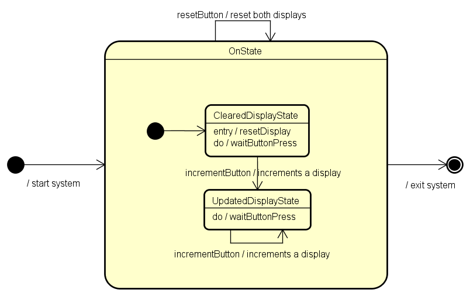

# CAO Project Report
**AVR Project Written in Assembly**
  
**Written By:**  
Christian Schou Sørensen  
Flemming Vindelev  
Ionel-Cristinel Putinica  
Mihail Rumenov Kanchev   

# Purpose
>*“The purpose of this assignment is to write a small software project in assembler code. The MCU to be used is the AVR ATmega2560, and the project should include some form of interaction with sensors and actuators.”*   

# Brainstorming
Firstly, the teacher gave a quick presentation on the different input and output units available in this project. Thereafter, the group started doing some brainstorming on what type of system could be made. The following ideas are what the group came up with, before making the final decision of what to make.  

**Idea 1:**   
The first idea involved using the ultrasonic sensor as input and the LED bar graph as output. This system would measure distance, and the closer it got to something the more bars would light up.  

**Idea 2:**   
The second idea would use the Temperature and humidity sensor together with the 7-segment display. The idea of this system is to measure the temperature and display it on the display.  

**Idea 3:**  
The third idea would utilize the PS2 joystick module and the dot matrix display. This system would light up a dot on the display, this dot would then be "movable" by using the joystick.  

**Idea 4:**  
This idea took a more simple approach where the input would be a button, which would activate the active/passive buzzer.  

**Idea 5:**  
The last idea uses three buttons where two of which, would increment a counter on their own single digit 7-segment display. While the third button would act as a reset for the displays.  

**Conclusion**  
The group ended up implementing the last idea (Idea 5), after researching how to use some of the different components.   

# Problem Statement  
Creators of foosball tables need an easy and reliable way to track the scores of the games, since the physical and primitive system included into their tables are not always reliable, they tend to break or to get worn out.   

# Analysis

## Activity Diagram

 

## State-Machine Diagram
  

# Design

## Breadboard Schematic
  

# Implementation

# Testing
Test cases have been created for the project, with the purpose of checking if the features and the different components work properly. The only type of testing included is going to be performed on the actual model of the project, since a digital model that allows for testing has not been created.  

## Test Case 1
Test case where both displays start with the value of “0”. The red button, which controls the first display is pressed three times, and after that, the blue button, which controls the second display is pressed five times.   
**Expected result:**  
&nbsp;&nbsp;&nbsp;&nbsp;&nbsp;&nbsp;The 1st display shows the value of “3”  
&nbsp;&nbsp;&nbsp;&nbsp;&nbsp;&nbsp;The 2nd display shows the value of “5”  
**Model result:**  
&nbsp;&nbsp;&nbsp;&nbsp;&nbsp;&nbsp;The 1st display shows the value of “3”  
&nbsp;&nbsp;&nbsp;&nbsp;&nbsp;&nbsp;The 2nd display shows the value of “5”  

## Test Case 2
Test case where the first display starts with the value of “4”, and the second display starts with the value of “7”. The red button, which controls the first display is pressed once, and after that, the blue button, which controls the second display is pressed twice.   
**Expected result:**  
&nbsp;&nbsp;&nbsp;&nbsp;&nbsp;&nbsp;The 1st display shows the value of “5”  
&nbsp;&nbsp;&nbsp;&nbsp;&nbsp;&nbsp;The 2nd display shows the value of “9”  
**Model result:**  
&nbsp;&nbsp;&nbsp;&nbsp;&nbsp;&nbsp;The 1st display shows the value of “5”  
&nbsp;&nbsp;&nbsp;&nbsp;&nbsp;&nbsp;The 2nd display shows the value of “9”  

## Test Case 3
Test case where the first display starts with the value of “4”, and the second display starts with the value of “7”. The red button, which controls the first display is pressed 5 times, and after that, the blue button, which controls the second display is pressed four times. At the end, the white button, which has the purpose of resetting both displays is pressed.   
**Expected result:**  
&nbsp;&nbsp;&nbsp;&nbsp;&nbsp;&nbsp;The 1st display shows the value of “0”  
&nbsp;&nbsp;&nbsp;&nbsp;&nbsp;&nbsp;The 2nd display shows the value of “0”  
**Model result:**  
&nbsp;&nbsp;&nbsp;&nbsp;&nbsp;&nbsp;The 1st display shows the value of “0”  

## Test Case 4
Test case where the first display starts with the value of “4”, and the second display starts with the value of “7”. The red button, which controls the first display is pressed 5 times, and after that, the blue button, which controls the second display is pressed twice times. After that, the white button, which has the purpose of resetting both displays is pressed. The test case is finished by pressing the red button twice, and the blue button seven times.   
**Expected result:**  
&nbsp;&nbsp;&nbsp;&nbsp;&nbsp;&nbsp;The 1st display shows the value of “2”  
&nbsp;&nbsp;&nbsp;&nbsp;&nbsp;&nbsp;The 2nd display shows the value of “7”  
**Model result:**  
&nbsp;&nbsp;&nbsp;&nbsp;&nbsp;&nbsp;The 1st display shows the value of “2”  
&nbsp;&nbsp;&nbsp;&nbsp;&nbsp;&nbsp;The 2nd display shows the value of “7”  

## Test Case 5
Test case where both displays start with the value of “0”. The red button, which controls the first display is pressed four times, and after that, the blue button, which controls the second display is pressed five times. At the end, both the red and the blue button are pressed twice, both at the same time.   
**Expected result:**  
&nbsp;&nbsp;&nbsp;&nbsp;&nbsp;&nbsp;The 1st display shows the value of “6”  
&nbsp;&nbsp;&nbsp;&nbsp;&nbsp;&nbsp;The 2nd display shows the value of “7”  
**Model result:**  
&nbsp;&nbsp;&nbsp;&nbsp;&nbsp;&nbsp;The 1st display shows the value of “6”  
&nbsp;&nbsp;&nbsp;&nbsp;&nbsp;&nbsp;The 2nd display shows the value of “7”  

## Test Case 6
Test case where the first display starts with the value of “2”, and the second display starts with the value of “6”. The red button, which controls the first display is pressed once, and after that, the blue button, which controls the second display is pressed three times. At the end, the red button and the white button are pressed at the same time.   
**Expected result:**  
&nbsp;&nbsp;&nbsp;&nbsp;&nbsp;&nbsp;The 1st display shows the value of “0”  
&nbsp;&nbsp;&nbsp;&nbsp;&nbsp;&nbsp;The 2nd display shows the value of “0”  
**Model result:**  
&nbsp;&nbsp;&nbsp;&nbsp;&nbsp;&nbsp;The 1st display shows the value of “0”  
&nbsp;&nbsp;&nbsp;&nbsp;&nbsp;&nbsp;The 2nd display shows the value of “0”  

## Test Case 7
Test case where the first display starts with the value of “0”, and the second display starts with the value of “2”. The red button, which controls the first display is pressed ten times, and after that, the blue button, which controls the second display is pressed twelve times.   
**Expected result:**  
The 1st display shows the value of “9”  
The 2nd display shows the value of “9”  
**Model result:**  
The 1st display shows the value of “9”  
The 2nd display shows the value of “9”   
